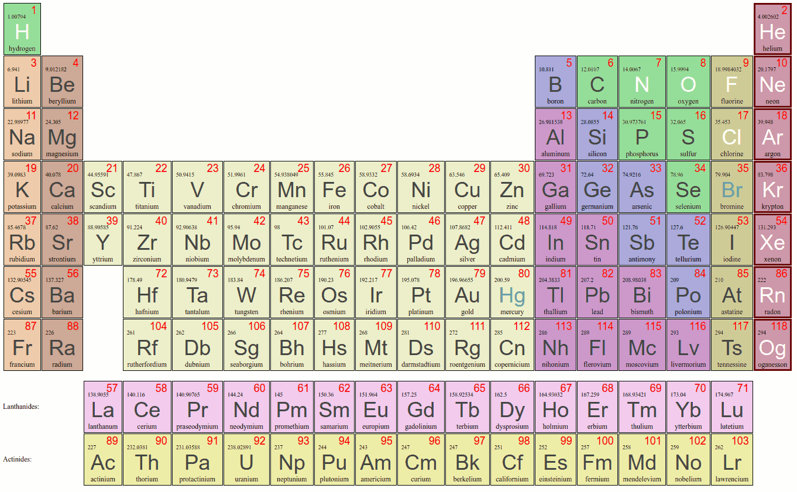

# Django Periodic Table



<a class="mk-toclify" id="table_of_contents"></a>

# Table of Contents

- [About](#about)
- [Installation](#installation)
    - [Get Django](#get-django)
    - [Clone the repo](#clone-the-repo)
    - [Activate app](#activate-app)
    - [Migrate the database](#migrate-database)
- [Roadmap dev](#roadmap-dev)

## About

Django Periodic Table (DPT) is intended to provide support for other apps pertaining to chemistry based in Django. The impetus for this project was to create a system for information on materials for the machinist community.

The core of the system is based on the [periodictable module](https://github.com/pkienzle/periodictable/); this app is a wrapper for the data therein, with extensions provided by Django's ORM machinery.

The code was initially developed in August 2017, using periodictable 1.5.0, Django 1.11 and Python 3.5.2 under Ubuntu 16.04LTS. This includes all elements known in late 2017, up to and including oganesson.

### Element Classification

The DPT models file contains categorizations of metallicity (metal, metalloid and nonmetal) and periodic table groupings (halogens, noble gases, alkali metals, alkali earths, transition metals, base metals, lanthanides, and actinides). These include the defintion of CSS classes (e.g., *dpt_met* for metals; *dpt_aear* for alkali earths) to facilitate presentation. Also included are phases of matter at STP; for example, mercury and bromine are laballed as liquids.

Also included is a custom *PeriodicTableManager* class, featuring methods for accessing these such as 

```
    >>> Element.objects.noble_gases.filter(atomic_number__lte=50)
    <QuerySet [<Element: helium(He)>, <Element: neon(Ne)>, 
    <Element: argon(Ar)>,<Element: krypton(Kr)>]>
```

Since hydrogen isotopes deuterium and tritium are in the database, the PeriodicTableManager property *normal_elements* excludes them to ensure only one element has the atomic number 1.

### Element groups

Additionally, the column numbers for elements are stored in the database and mapped to conventional labels: for example, group 1 has label *1A* and groups 8-10 share label *8B*. These are also defined into CSS classes such as *dpt_8B* for convenience. The classification labels are wrapped for i18n translation, and the mappings can be overridden by subclassing and redefining the *CATEGORY_LABELS* and *CSS_CLASSES* dictionaries, if desired.

Elements in a given group label can be accessed through the PeriodicTableManager's *group_by_name* method, in a case-insensitive manner:

```
    >>> Element.objects.group_by_name('8b').all()
    <QuerySet [<Element: iron(Fe)>, <Element: cobalt(Co)>, <Element: nickel
    (Ni)>, <Element: ruthenium(Ru)>, <Element: rhodium(Rh)>, <Element: 
    palladium(Pd)>, <Element: osmium(Os)>, <Element: iridium(Ir)>, <Element: 
    platinum(Pt)>, <Element: hassium(Hs)>, <Element: meitnerium(Mt)>, 
    <Element: darmstadtium(Ds)>]>
```

### Element periods

Finally, element period membership --- the row they occupy on the table --- is calculated by scanning through the noble gas atomic numbers and comparing them to the element in question. Since it will be a long time between element 119's addition to the table and the noble gas that ultimately may follow it, the method returns 8 if the search fails to match. (If this code is still in use at that time, the author will be really astonished... but that won't break the code either, it will just progress on to period nine.)

## Installation

While the code was developed under Django 1.11 and Python 3.5.2, it should work under any reasonably recent version of Django under Python 2 as well; it has been tested under Django 1.9 and Python 2.7 with no bugs apparent and all tests succeeding.

### Get Django

If you are not adding this to a pre-existing Django installation, you may find [installation instructions on the Django project site](https://docs.djangoproject.com/en/1.11/intro/install/).

### Clone the repo

```
git clone https://github.com/Autographic/django_periodic_table.git
```

```
cd django_periodic_table/django_periodic_table
```

You should replace that string with real random data... (read the Django docs for more info).

### Activate app

Place the app folder in your Django installation's main directory, and add *django_periodic_table* to your INSTALLED_APPS in settings. See Django docs for more details.

### Migrate the database

Executing the command
```
./manage by migrate
```
will create the necessary database structures and should import the required data from the fixtures. If the data does not import, you can make that happen with
```
./manage.py loaddata django_periodic_table/fixtures/initial_data.json
```

## Roadmap dev

* Templates and user interface
* Compounds and mixtures support
